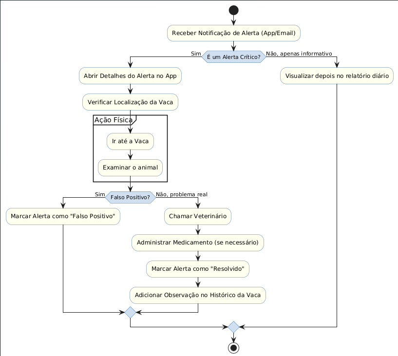

# TechMuuu 🐄

[](https://github.com/Nati-i/TechMuu)
[](https://www.java.com)
[](https://www.postgresql.org)

---

## 📌 Sumário

* [Sobre o Projeto](#sobre-o-projeto)
* [Objetivos](#objetivos)
* [Funcionalidades](#funcionalidades)
* [Requisitos Não Funcionais](#requisitos-não-funcionais)
* [Arquitetura do Banco de Dados](#arquitetura-do-banco-de-dados)
* [Tecnologias Utilizadas](#tecnologias-utilizadas)
* [Demonstração do Sistema](#demonstração-do-sistema)
* [Segurança](#segurança)
* [Estrutura do Repositório](#estrutura-do-repositório)
* [Contribuições](#contribuições)
* [Observações Finais](#observações-finais)

---

## Sobre o Projeto

**TechMuuu** é um sistema voltado para **produtores rurais**, que permite **monitorar a saúde e reprodução do rebanho bovino** em tempo real através de um software mobile e web.

O projeto integra **hardware e software**, utilizando coleiras inteligentes que medem **ruminação, temperatura e atividade** das vacas, gerando alertas de saúde e reprodução.

---

## Objetivos

* Monitorar a saúde do rebanho bovino em tempo real.
* Detectar padrões de saúde (ex.: febre, estresse) e reprodução (ex.: cio).
* Facilitar a gestão de coleiras e animais por administradores e produtores.
* Gerar alertas inteligentes para decisões estratégicas rápidas.

---

## Funcionalidades

### Para Administradores

| Funcionalidade          | Descrição                                                |
| ----------------------- | -------------------------------------------------------- |
| Cadastro de produtores  | Criar, editar, consultar e desativar clientes/produtores |
| Alocação de coleiras    | Associar coleiras a contratos/cliente                    |
| Painel de monitoramento | Visualizar status de todas as coleiras ativas            |
| Logs de ação            | Registrar atividades dos administradores                 |

### Para Produtores Rurais

| Funcionalidade           | Descrição                                                |
| ------------------------ | -------------------------------------------------------- |
| Autenticação segura      | Login e senha criptografados                             |
| Gerenciamento de animais | Cadastrar, editar e consultar animais                    |
| Associação de coleira    | Vincular coleira a animal específico                     |
| Dashboard do rebanho     | Monitoramento em tempo real                              |
| Visualização detalhada   | Histórico de temperatura, ruminação e estado reprodutivo |
| Alertas inteligentes     | Notificações de febre, estresse e cio                    |

---

## Requisitos Não Funcionais

1. **Segurança e isolamento** dos dados por produtor, comunicação criptografada.
2. Interface **intuitiva e responsiva**.
3. Suporte a crescimento de **50% no número de clientes e coleiras** sem reestruturação.
4. **Nenhuma perda de dados** sob condições normais de rede.

---

## Arquitetura do Banco de Dados

* **Tabelas principais**: `produtor`, `administrador`, `vaca`, `coleira`, `leitura_sensor`, `alerta`
* **Views**: `vw_vaca_detalhes`, `vw_alertas_recentes`, `vw_administrador_produtores`
* **Triggers e Procedures**: alertas de saúde, logs de ações, atualização de estado reprodutivo


O banco já contempla a **parte reprodutiva** do rebanho pelo campo `estado_reprodutivo` na tabela `vaca`.

---

## Tecnologias Utilizadas

* **Java** (Spring Boot / JPA)
* **PostgreSQL**
* **Frontend Web responsivo** (mobile e desktop)
* **GitHub** para versionamento

---

## Demonstração do Sistema

* Painel do rebanho e dashboard por animal
* Alertas inteligentes de saúde e cio
* Visualização de histórico de dados dos animais




---

## Segurança

* Criptografia de dados entre coleira e servidor
* Isolamento de dados por produtor
* Controle de acesso baseado em **roles** (`gestor_produtores`, `tecnico_suporte`)

---

## Estrutura do Repositório

```
TechMuuu/
├─ Database/
│  ├─ Modelo ER.png
│  ├─ Procedures.sql
│  ├─ Roles_Permissoes.sql
│  ├─ Schema_Tabela.sql
│  ├─ Script.sql
│  └─ Script_Povoamento.sql
├─ Diagramas/
│  ├─ Diagrama_Atividade.png
│  ├─ Diagrama_Sequencia.png
│  ├─ Diagrama_Caso_de_Uso.png
│  └─ Diagrama_Classes.png
├─ Frontend/
│  └─ [Arquivos do front-end]
└─ README.md
```

---

## Contribuições

* **Equipe:** [Seu Nome / Integrantes]
* **Orientador:** [Nome do Professor]
* **Data:** 2025

---

## Observações Finais

O TechMuuu integra **tecnologia, saúde animal e gestão rural**, sendo uma ferramenta estratégica para **maximizar produtividade e reduzir riscos sanitários**.

---

📌 **Nota:** Este README serve também como base acadêmica e material de apresentação para demonstração do projeto.
